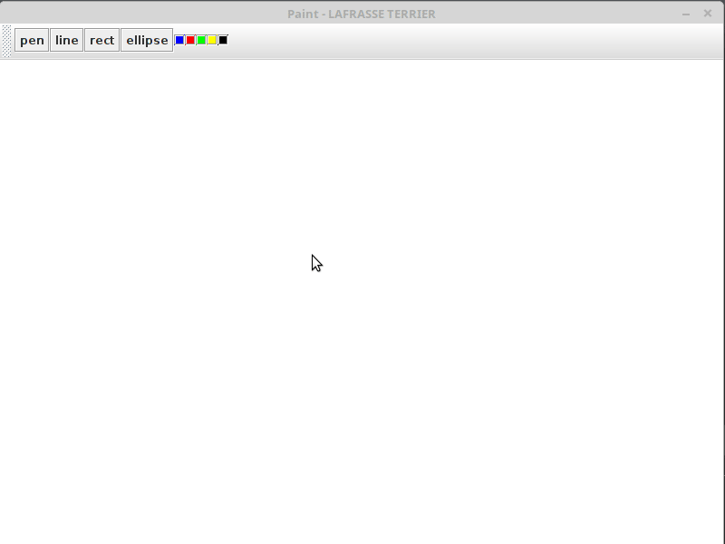

# MarkingMenu
TP2 IIHM RICM5 Polytech Grenoble

## Membres :
Cédric LAFRASSE - Bastien TERRIER

## Utilisation 
Veuillez commencer par lancer l’application dont le main se situe dans la classe Paint.java. 
Pour ouvrir le marking menu, il faut réaliser un clic droit dans la fenêtre de dessin. Une fois ce click réalisé (PRESSED -> RELEASED) notre marking menu apparaît. 
Pour sélectionner un choix, il suffit de sortir la souris du menu au niveau de l’onglet choisi. 
Nous possédons deux menus successif. Le premier permet de choisir entre Outil et Couleur. Le second menu dépend du premier choix, en affichant soit la liste d’outil, soit un panel de couleur.

## Nos choix 
Nous avons tout d’abord fait le choix de laisser la toolbar comme dans la version original du Paint. Nous pensons qu’un utilisateur débutant sera plus à même d’utiliser une toolbar qu’un marking menu et souhaitons que ce logiciel de dessin soit accessible à tous.
Cela nous laisse aussi l'opportunité de comparer les performances des utilisateurs en utilisant les deux menus. Ce choix est lourd de conséquences car nous devons gérer à la fois les événements provenant de la toolbar et du marking menu.

## Le projet idéal 

### Gestions d’une multitude d’outils
Dans cette version, le nombre d’outils et de couleurs sont limités à 7. Nous avons pensé rajouter un petit +, parmis la liste de choix, afin d’accéder à un nouveau Marking Menu composé de choix supplémentaires. 

### Repositionnement du marking menu 
Dans l’état actuel des choses, notre menu est fixe. Si nous ouvrons le menu trop proche d’un bord de la fenêtre, une grande partie de celui ci ne sera pas affiché. Nous avons pensé à adapter l’affichage dans la partie visible du menu. Si nous ne pouvons pas tout afficher dans la partie visible, alors nous utiliserons l’outil “+” pour afficher les choix supplémentaires.
